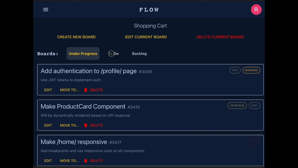

<h1 align="center">
  📑 Project Management App
</h1>

A web application that helps you manage your software projects by creating workspaces, boards, and tickets!

<div align="center">


</div>

## Key Features ✨

- Enhanced SEO by taking advantage of Next.js' static generation and server-side rendering capabilities
- Utilized NextAuth to authenticate users and store their data in a MongoDB database
- Created a fully responsive design that works on all devices and screen sizes
- Incorporated a atomic design pattern that allows for easy scaling and maintenance

## Showcase 🎥

<div align="center">

[Visit Flow](https://project-management-app-eight.vercel.app/)

</div>

<div align="center">



</div>

## Technologies Used 💻

<p align="center">
  
  
  
  
  
</p>

_(react, typescript, nextjs, vercel, nextauth, SSR, mongoose, MUI components, cloudinary, axios, useEffect, useState, promise based functions, async/await, custom API, etc...)_

## How to install and run?

```bash
# Clone this repository
  git clone https://github.com/rcamach7/project-management-app
  cd project-management-app

#  Run local server
  yarn install
  yarn dev
```

Application would need the following environments and variables provided to run successfully on a .env file:

- MONGODB_URI, TOKEN_SECRET, GOOGLE_CLIENT_ID, GOOGLE_CLIENT_ID, NEXTAUTH_SECRET, NEXTAUTH_URL
